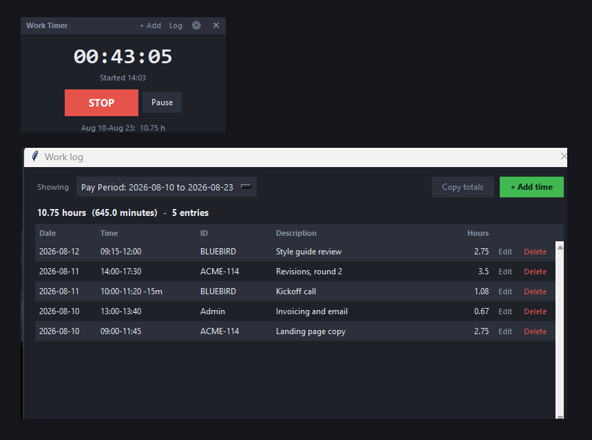

# Work Timer

A small floating stopwatch for Windows that logs your work into markdown files,
grouped into the period you choose — daily, weekly, fortnightly, monthly, or one
ongoing log — and totalled by the external ID you bill against.

Built for freelancers who submit hours per client, project or ticket reference
at the end of each pay period.



- **One button.** START, STOP, and Pause for when you step away.
- **Decimal hours and minutes**, totalled per ID, ready to invoice.
- **Plain markdown** in a folder you own — no account, no cloud, no database.
- **Nothing to install** beyond Python. No build step, no dependencies.

## Getting it

### Just want to use it

Download **`Work Timer.exe`** from the
[latest release](../../releases/latest) and put it in a folder of its own —
somewhere you can write to, like `Documents\Work Timer`, not `Program Files`.
Double-click it. That's the whole install: no Python, no setup, no admin rights.

Your logs appear in a `Time Logs` folder next to the .exe, so keep it somewhere
you'll find again. To move it later, move the whole folder and your history
comes with it.

> **Windows will warn you the first time.** The .exe isn't code-signed (a
> certificate costs several hundred a year), so SmartScreen shows "Windows
> protected your PC". Click **More info** → **Run anyway**. Some antivirus
> scanners also flag apps built this way; it's a known false positive with
> PyInstaller, not something the app is doing.

### Running from source instead

Clone or download the repo and double-click **`Work Timer.vbs`**. No console
window appears. Needs Python — see *Requirements* below.

To make either version easy to reach: right-click it → **Show more options** →
**Send to** → **Desktop (create shortcut)**. You can pin that shortcut to the
taskbar or Start.

## Using it

- The window floats above everything else. **Drag it anywhere** by grabbing any
  part of it — the clock, the title bar, the empty space.
- Press **START** when you begin working. The clock counts up.
- **Pause** appears next to STOP while a session is running. Use it when you
  step away for a few minutes — see *Pausing* below.
- Press **STOP** when you're done. You'll be asked for:
  - **External ID** — required. Recent IDs sit underneath as buttons, **All IDs
    ▾** lists every one you've used, and a note tells you what will be saved.
    See *External IDs* below.
  - **Description** — optional, a short note about what the time went to.
  - **Save** (or Enter) records it. **Discard** (or Escape) throws it away.
- The bottom line always shows the running total for the current period.
- **Log** opens the work log, to review or correct what you've recorded.
- The **⚙** opens settings — grouping, colours and fonts.

## Pausing

Answering the door shouldn't turn one meeting into two log entries. **Pause**
stops the clock without ending the session; **Resume** picks it up again. The
whole thing stays a single entry.

While paused, the clock freezes and dims, so a glance tells you it isn't
counting. Take as many breaks as you like — they add up.

What gets recorded is the **span, minus the breaks**:

> Started 09:00, two breaks totalling 15 minutes, stopped 11:00
> → one entry, `09:00–11:00`, **1.75 h billed**.

The start and end times stay honest about when you were at it, and the hours
bill only the time you worked. Where an entry has a break:

- the log window shows it in the Time column, e.g. `09:00-11:00 -15m`
- the pay-period markdown gains a **Break** column — but only in periods that
  actually contain one, so ordinary periods look exactly as before
- the **Totals by ID** table you invoice from is unchanged, and counts worked
  time only

**Stopping while paused** ends the entry at the moment you paused, not the
moment you pressed STOP — the work really finished when you stepped away.

**If the app dies mid-break**, the recovery prompt knows: it ends the session at
the break and has the earlier breaks already deducted, so an interrupted session
never bills the time you were away.

To correct a break afterwards, open the entry from the **Log** window. Entries
that have one get a **Break (min)** field — change it, or set it to 0 to remove
it, and the hours recalculate.

### Adding time you forgot to track

Click **+ Add time** in the title bar. Fill in the date, start and end times, the
external ID, and an optional description. It logs exactly like a timed session.

The fields are forgiving — all of these work:

| Field | Accepts |
| --- | --- |
| **Date** | `today` (the default), `yesterday`, `2026-08-09`, `8/9`, `8/9/2026`, `Aug 9` |
| **Start / End** | `9`, `9:30`, `930`, `0930`, `9.30`, `9:30am`, `2pm`, `14:00` |

As you type, the dialog shows the duration it worked out — `= 1.5 h (90 min)` —
so a typo is obvious before you save. A time with no `am`/`pm` is read on the
24-hour clock, so a 1pm meeting typed as `1:00` reads as 1 AM; the live duration
will show something absurd like `13.5 h` if you get it wrong. If the end time is
before the start, it's treated as an overnight session and labelled as such.
- The **✕** closes the app. If a timer is still running, you'll be prompted to
  log it first, so nothing gets lost.
- The window remembers where you left it.

## External IDs

Totals are grouped by ID, so `Admin` and `admin` would appear as two separate
lines on the invoice — easy to type, easy to miss. IDs that differ only in
capitalisation or spacing are treated as the same one and stored under a single
spelling.

**What counts as the same ID:** case and spaces are ignored, so `Admin`,
`admin`, `ADMIN` and ` Admin ` all match, as do `BlueBird2` and `bluebird 2`.
Punctuation is kept, so `ACME-114` and `ACME114` stay distinct — in a ticket
system those can genuinely be different things.

**Which spelling wins:** the one you've used most, with ties going to the most
recent. One stray `admin` never renames the `Admin` you've used twenty times.

Three things in the ID box help before you save:

- **Recent** buttons for your last three IDs.
- **All IDs ▾** — every ID you've used, with its total hours, most used first.
- A note under the box saying what will actually be saved: *Will be saved as
  "Admin"* when the spelling differs, or **New ID — nothing logged under this
  before** when nothing matches. That second one is what a typo looks like, so
  if you see it on an ID you've used before, check your spelling.

**Renaming still works.** When you edit an entry, that entry doesn't get a vote
on its own spelling — so changing the only `BlueBird2` entry to `bluebird 2`
genuinely renames it. If two other entries still say `BlueBird2`, editing one of
them folds back to the majority; rename them one at a time to change them all.

## If the app dies while a timer is running

A running timer would otherwise exist only in memory, so a crash, a forced
shutdown, a power cut or a Windows update reboot would take that time with it —
silently, with nothing to tell you it happened.

Pressing START now writes a small `Time Logs/running.json` noting the start time,
and refreshes it every 30 seconds while the timer runs. That second part matters:
if the app dies, the last refresh is the closest thing to a record of when you
actually stopped working — far better than assuming the time you next open the
app, which could be days later.

Next launch, you get a **Recovered timer** prompt showing the start time, the
last moment the app was alive, and the duration between them. It's the normal
add-time form, so you can correct either time before saving, and it needs an ID
like any other entry.

- **Keep it** logs the time.
- **Cancel** asks whether to discard. Decline, and the prompt returns next launch
  rather than the time being dropped quietly.

Stopping a timer normally clears the marker, so you'll never be asked about a
session you already logged.

## Only one copy runs at a time

Two copies would both write `entries.json`, and whichever saved last would
silently erase the other's entry. So if you launch it again while it's already
running — a stray double-click, or a startup shortcut on top of an open app —
the second launch simply brings the running one to the front and exits.

If the app was killed rather than closed, its lock is left behind. The next
launch checks whether that process is really still alive and takes over if not,
so a crash never locks you out.

## Starting with Windows

**⚙ → General → Start Work Timer when I sign in to Windows.** Off unless you
turn it on.

Ticking it puts a small launcher in your Windows Startup folder; unticking
removes it. Nothing else on the system is touched, and you can also just delete
that file by hand — it's at:

```
%APPDATA%\Microsoft\Windows\Start Menu\Programs\Startup\Work Timer.vbs
```

## Backups

`entries.json` is the source of every total you invoice, so the moment before
each change it's copied twice:

| File | What it holds |
| --- | --- |
| `Time Logs/entries.previous.json` | The state immediately before the most recent change — undoes one bad edit or delete |
| `Time Logs/backups/entries-YYYY-MM-DD.json` | Written once per day, the first time anything changes that day, so it holds the state *before* that day's work |

Daily snapshots are kept for 60 days, then pruned. The two layers cover
different mistakes: the previous copy catches "I just deleted the wrong row",
the daily ones catch "something's been wrong since last week".

**To restore**, close the app, copy the backup over `Time Logs/entries.json`,
and reopen — the markdown rebuilds from it automatically. (Copy, don't move, so
you still have the backup if you grabbed the wrong one.)

A failed backup never blocks a save: recording your time matters more than
keeping a copy of the previous state.

## Reviewing and fixing the log

Click **Log** in the title bar. You get every entry for one period, newest
first, with its date, times, ID, description and decimal hours, and a running
total at the top.

- **Showing** switches between periods, or **All time** for everything at once.
  It opens on the period you're in now.
- **Copy totals** puts the shown period's totals on the clipboard, tab
  separated — pastes straight into a spreadsheet, or reads fine as plain text:

  ```
  Pay Period: 2026-08-10 to 2026-08-23

  ID        Hours   Minutes
  ACME-114  6.25    375.0
  Admin     0.67    40.0
  BLUEBIRD  3.83    230.0
  Total     10.75   645.0
  ```
- **Click a column heading to sort** — by date, ID, description or hours. Click
  the same heading again to reverse it. Date and hours start with the newest and
  longest first; names start at A. Sorting by ID groups everything for one
  client together, which is the view to check before invoicing. The chosen
  order is remembered.
- **Edit** on any row reopens it in the same form used for adding time, with the
  values filled in. Change anything — including the date — and save.
- **Delete** removes an entry after asking you to confirm. There's no undo.
- **+ Add time** adds an entry without leaving the window.

Every change rewrites the affected markdown files immediately, so the totals in
them always match what you see here. Editing an entry's date moves it into the
right period file and out of the old one; if that empties a period completely,
its file is removed.

## Appearance

The **Appearance** tab of settings has:

- **Colours** — Midnight, Nord, Forest, Dracula, Solarized Dark, Paper (light),
  or High Contrast.
- **Interface font** and **Clock font** — chosen from the fonts installed on
  this machine.

A live preview shows the clock, a sample entry and the START button in your
chosen combination before you commit. Changes apply the moment you save; a
running timer keeps running.

## Choosing how time is grouped

Click the **⚙** in the title bar. **New log file starts** offers:

| Setting | What you get | Then choose |
| --- | --- | --- |
| **No periods — one ongoing log** | Everything in a single `All Time.md`, until you change it | — |
| **Daily** | One file per day you log time | — |
| **Weekly** | One file per week | Which weekday the week starts on |
| **Every 2 weeks** | One file per fortnight *(the default)* | A date a period starts on |
| **Monthly** | One file per month | Which day of the month it starts (1–28) |

The dialog shows the resulting period live — `Current period: Aug 10, 2026 to
Aug 23, 2026` — so you can confirm before saving.

For **Every 2 weeks**, give it any single real period start date; fortnights are
counted from there in both directions, forever, so it never needs revisiting.
For **Monthly**, a start day other than 1 gives you periods like the 15th to the
14th.

### Changing it later is safe

Hit Save and every log file is rebuilt under the new grouping — switch from
fortnightly to monthly and your existing entries are reshuffled into monthly
files, with the old files removed. Nothing is lost, because the entries live in
`entries.json`, not in the markdown.

Only files Work Timer generated are ever deleted; they're identified by the
footer line each one carries. Anything you wrote or dropped into `Time Logs`
yourself is left alone.

### Which period an entry lands in

An entry belongs to the period its **start time** falls in, so a session running
past midnight still counts against the day you began. Manually added time works
the same way — backdate it and it lands in the right file, even a closed period.

## The log file

Each period gets its own file — `Time Logs/2026-08-10 to 2026-08-23.md` on the
default fortnightly setting — rewritten every time you add an entry:

```markdown
# Pay Period: 2026-08-10 to 2026-08-23

**6.33 hours (379.5 minutes) across 4 entries.**

## Totals by ID

| ID | Hours (decimal) | Minutes | Entries |
| --- | ---: | ---: | ---: |
| PROJ-88 | 3.5 | 210.0 | 1 |
| SD-4471 | 2.83 | 169.5 | 3 |
| **Total** | **6.33** | **379.5** | **4** |

## Entries

| Date | Start | End | ID | Description | Hours (decimal) | Minutes |
| --- | --- | --- | --- | --- | ---: | ---: |
| 2026-08-10 | 09:00 | 10:44 | SD-4471 | logo revisions | 1.74 | 104.5 |
| 2026-08-11 | 13:15 | 14:00 | SD-4471 | client call | 0.75 | 45.0 |
| 2026-08-12 | 08:00 | 11:30 | PROJ-88 | onboarding docs | 3.5 | 210.0 |
| 2026-08-20 | 16:00 | 16:20 | SD-4471 |  | 0.33 | 20.0 |
```

The **Totals by ID** table is what you submit. Totals are summed from raw
seconds and rounded once at the end, so they never drift from rounding each
entry individually.

> **Don't hand-edit the markdown.** It's rebuilt from scratch after every
> change, so your edits would be overwritten. To correct something, use the
> **Log** window — that's what it's for. The underlying data lives in
> `Time Logs/entries.json`.

Any markdown file you write yourself and keep in `Time Logs` is safe: the app
only ever deletes files carrying its own generated footer.

## Requirements

The **.exe needs nothing** — not even Python. To run from source you need:

- **Windows** — the launcher, the startup option and the single-instance check
  are Windows-specific.
- **Python 3.8 or newer**, with tkinter (included in the standard python.org
  installer and in Anaconda/Miniconda).

No third-party libraries either way.

To check what you have, run `python --version` in a terminal. If Python isn't
installed, get it from [python.org](https://www.python.org/downloads/) and tick
**Add python.exe to PATH** during setup.

## Files

| File | What it is |
| --- | --- |
| `Work Timer.vbs` | The launcher you double-click |
| `work_timer.py` | The floating timer window |
| `wt_dialogs.py` | The log viewer and the other windows |
| `wt_core.py` | Periods, stored entries, markdown output |
| `wt_theme.py` | Colour schemes and fonts |
| `settings.json` | Window position, grouping, colours, fonts (not in git — it's per machine) |
| `app.lock` | Names the running copy, so a second one hands over |
| `Time Logs/entries.json` | The real record of every session |
| `Time Logs/entries.previous.json` | The state before the most recent change |
| `Time Logs/backups/` | Daily snapshots, kept 60 days |
| `Time Logs/running.json` | Only exists while a timer is running |
| `Time Logs/*.md` | One generated file per period |

If the window ever ends up off the edge of the screen — say a second monitor
gets unplugged — it moves itself back to the top-left on next launch rather than
being stranded where you can't reach it.

## Which version am I running?

**⚙ → General → About** shows the version, and where your logs are kept, with a
button to open that folder. Worth quoting both if you report a problem.

## Building the .exe

```
pip install pyinstaller
python build_exe.py
```

The result is `dist/WorkTimer.exe` — one self-contained file, around 11 MB,
which is what gets attached to a release. Build output is not committed.

To publish a new version, follow [RELEASING.md](RELEASING.md) — it starts with
bumping the version, which is the step that gets forgotten.

## Your data stays yours

Everything lives in the `Time Logs` folder beside the app: `entries.json` plus
generated markdown. No account, no network access, no telemetry — the app never
connects to anything.

`Time Logs/` and `settings.json` are **not tracked by git**. If you fork or
clone this, your own hours never end up in a commit.

## Licence

Copyright 2026 CryptKeeperCrimson. All rights reserved — see [LICENSE.md](LICENSE.md).

- **Use it for your own work**, including work you're paid for. No need to ask.
- **Share it unchanged**, and modify it for your own use.
- **Don't make a product out of it** — no selling it, charging for access,
  offering it as a service, or bundling it into something you sell.

Source-available, not open source.
